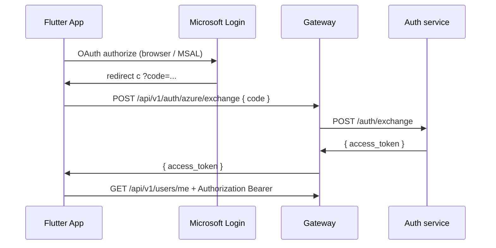

# Flutter: настройка авторизации (Microsoft / Azure AD)

Инструкция для мобильного приложения **Flutter**, которое ходит в API через
**gateway** (`tickets-back`). Веб-приложение использует редиректы и (опционально)
httpOnly-cookie; **мобильный клиент работает только с Bearer JWT** в заголовке
`Authorization`.

---

## 1. Как устроена авторизация в системе

| Компонент | Роль |
| --------- | ---- |
| **Azure AD** | Вход через корпоративный Microsoft-аккаунт |
| **Gateway** | Единая точка входа для клиентов: `/api/v1/...` |
| **Auth-сервис** | Обмен OAuth `code` → JWT, профиль пользователя |
| **JWT** | Токен доступа ко всем API (срок жизни по умолчанию **24 ч**) |

Схема для **Flutter** (authorization code):



**Refresh-токена на бэкенде нет.** После истечения JWT (или logout) пользователь
снова проходит OAuth.

---

## 2. Azure AD (App Registration)

В [Azure Portal](https://portal.azure.com) → **App registrations** → ваше приложение.

### 2.1. Платформы и Redirect URI

Для **native/Flutter** добавьте redirect URI, совпадающий с тем, что будет в
приложении и на сервере:

| Платформа | Пример redirect URI |
| --------- | ------------------- |
| Android (MSAL) | `msal{CLIENT_ID}://auth` |
| iOS (MSAL) | `msal{CLIENT_ID}://auth` |
| Custom scheme | `com.kostalegal.tickets://oauth/callback` |

В Azure можно зарегистрировать **несколько** redirect URI (веб + mobile).

### 2.2. Переменные на сервере (auth / gateway)

Должны совпадать с регистрацией в Azure:

| Переменная | Пример |
| ---------- | ------ |
| `AZURE_TENANT_ID` | GUID tenant |
| `AZURE_CLIENT_ID` | GUID приложения |
| `AZURE_CLIENT_SECRET` | секрет (confidential client) |
| `AUTH_REDIRECT_URI` | **тот же redirect URI, что использует Flutter** |
| `JWT_SECRET` | общий секрет gateway + auth (≥32 символа в prod) |
| `GATEWAY_BASE_URL` | `https://ticketsback.kostalegal.com` |

Важно: при обмене `code` сервер передаёт в Azure **тот же** `redirect_uri`, что
задан в `AUTH_REDIRECT_URI`. Если в Flutter другой scheme — либо:

- выставьте `AUTH_REDIRECT_URI` под mobile (отдельный стенд), либо  
- договоритесь о доработке бэка: передавать `redirect_uri` в `POST /exchange`.

Для **веба** redirect обычно:

`https://ticketsback.kostalegal.com/api/v1/auth/azure/callback`

Для **mobile** — отдельный custom scheme (см. таблицу выше).

### 2.3. Scopes

На бэкенде используются: `email`, `User.Read` (Microsoft Graph — фото профиля).
В Flutter укажите те же scopes в MSAL / AppAuth.

---

## 3. Зависимости Flutter (рекомендуемые)

```yaml
dependencies:
  flutter_appauth: ^6.0.0      # или msal_flutter / aad_oauth
  flutter_secure_storage: ^9.0.0
  http: ^1.2.0                 # или dio
```

- **`flutter_secure_storage`** — хранение JWT (Keychain / EncryptedSharedPreferences).
- **Не** храните токен в `SharedPreferences` без шифрования.

---

## 4. Конфиг приложения

```dart
class ApiConfig {
  /// База gateway БЕЗ /api/v1 на конце
  static const gatewayBase = String.fromEnvironment(
    'GATEWAY_BASE_URL',
    defaultValue: 'https://ticketsback.kostalegal.com',
  );

  static const azureTenantId = String.fromEnvironment('AZURE_TENANT_ID');
  static const azureClientId = String.fromEnvironment('AZURE_CLIENT_ID');

  /// Должен совпадать с AUTH_REDIRECT_URI на сервере и с Azure Portal
  static const redirectUri = String.fromEnvironment(
    'AUTH_REDIRECT_URI',
    defaultValue: 'com.kostalegal.tickets://oauth/callback',
  );

  static const discoveryUrl =
      'https://login.microsoftonline.com/$azureTenantId/v2.0';
}
```

Сборка:

```bash
flutter run \
  --dart-define=GATEWAY_BASE_URL=https://ticketsback.kostalegal.com \
  --dart-define=AZURE_TENANT_ID=... \
  --dart-define=AZURE_CLIENT_ID=... \
  --dart-define=AUTH_REDIRECT_URI=com.kostalegal.tickets://oauth/callback
```

---

## 5. Android / iOS: deep link

### Android (`AndroidManifest.xml`)

```xml
<intent-filter>
    <action android:name="android.intent.action.VIEW"/>
    <category android:name="android.intent.category.DEFAULT"/>
    <category android:name="android.intent.category.BROWSABLE"/>
    <data android:scheme="com.kostalegal.tickets" android:host="oauth" android:path="/callback"/>
</intent-filter>
```

### iOS (`Info.plist`)

```xml
<key>CFBundleURLTypes</key>
<array>
  <dict>
    <key>CFBundleURLSchemes</key>
    <array>
      <string>com.kostalegal.tickets</string>
    </array>
  </dict>
</array>
```

Scheme/host/path должны давать тот же redirect URI, что в Azure и `AUTH_REDIRECT_URI`.

---

## 6. Поток входа (пример с flutter_appauth)

```dart
import 'dart:convert';
import 'package:flutter_appauth/flutter_appauth.dart';
import 'package:flutter_secure_storage/flutter_secure_storage.dart';
import 'package:http/http.dart' as http;

const _storage = FlutterSecureStorage();
const _tokenKey = 'access_token';
const _appAuth = FlutterAppAuth();

Future<String?> signInWithMicrosoft() async {
  // Шаг 1: OAuth в системном браузере / Chrome Custom Tab → redirect с code
  final authResult = await _appAuth.authorize(
    AuthorizationRequest(
      ApiConfig.azureClientId,
      ApiConfig.redirectUri,
      discoveryUrl: ApiConfig.discoveryUrl,
      scopes: ['openid', 'profile', 'email', 'User.Read'],
    ),
  );
  final code = authResult?.authorizationCode;
  if (code == null || code.isEmpty) return null;

  // Шаг 2: обмен code → JWT на нашем gateway (client_secret только на сервере)
  final token = await _exchangeCodeOnBackend(code);
  if (token != null) {
    await _storage.write(key: _tokenKey, value: token);
  }
  return token;
}

Future<String?> _exchangeCodeOnBackend(String code) async {
  final url = Uri.parse('${ApiConfig.gatewayBase}/api/v1/auth/azure/exchange');
  final res = await http.post(
    url,
    headers: {'Content-Type': 'application/json'},
    body: jsonEncode({'code': code}),
  );
  if (res.statusCode != 200) {
    throw Exception('Exchange failed: ${res.statusCode} ${res.body}');
  }
  final data = jsonDecode(res.body) as Map<String, dynamic>;
  return data['access_token'] as String?;
}

Future<String?> readAccessToken() => _storage.read(key: _tokenKey);
```

> **Важно:** не встраивайте `AZURE_CLIENT_SECRET` в мобильное приложение.
> Обмен `code` → JWT выполняет **ваш сервер** (`POST .../auth/azure/exchange`).

---

## 7. HTTP-клиент

Все запросы к API — на gateway, с заголовком:

```http
Authorization: Bearer <access_token>
```

```dart
Future<http.Response> apiGet(String path) async {
  final token = await readAccessToken();
  if (token == null || token.isEmpty) {
    throw StateError('Not authenticated');
  }
  final uri = Uri.parse('${ApiConfig.gatewayBase}$path');
  return http.get(uri, headers: {
    'Authorization': 'Bearer $token',
    'Accept': 'application/json',
  });
}
```

### Базовые эндпоинты после входа

| Действие | Метод и URL |
| -------- | ----------- |
| Профиль + permissions | `GET /api/v1/users/me` |
| Выход (инвалидация JWT) | `POST /api/v1/auth/azure/session/logout` |
| Каталог коллег | `GET /api/v1/contacts/colleagues` |

Пример ответа `/users/me`:

```json
{
  "id": 42,
  "email": "user@company.com",
  "display_name": "Иван Иванов",
  "role": "Сотрудник",
  "position": "Accountant",
  "time_tracking_role": "manager",
  "permissions": {
    "v": 1,
    "time_tracking_can_view_reports": false,
    "vacation_can_manage_schedule": true
  }
}
```

Права UI — из `permissions` (см. `FRONTEND_INSTRUCTIONS.md`).

### Обработка 401

При `401 Unauthorized`:

1. Удалить токен из secure storage.
2. Показать экран входа (повторный OAuth).
3. Не полагаться на cookies — мобильный клиент их **не использует**.

---

## 8. WebSocket (чат, тикеты, уведомления)

Веб иногда авторизует WS через cookie. **Flutter — через query-параметр `token`:**

| Сервис | URL |
| ------ | --- |
| Чат | `wss://{host}/api/v1/chat/ws?token={jwt}` |
| Тикеты | `wss://{host}/api/v1/tickets/ws/tickets?token={jwt}` |
| Уведомления | `wss://{host}/api/v1/notifications/ws?token={jwt}` |

```dart
final wsUrl =
    'wss://ticketsback.kostalegal.com/api/v1/chat/ws?token=${Uri.encodeComponent(token)}';
final channel = WebSocketChannel.connect(Uri.parse(wsUrl));
```

Используйте **wss://** в production (HTTPS).

---

## 9. Выход

```dart
Future<void> signOut() async {
  final token = await readAccessToken();
  if (token != null) {
    await http.post(
      Uri.parse('${ApiConfig.gatewayBase}/api/v1/auth/azure/session/logout'),
      headers: {'Authorization': 'Bearer $token'},
    );
  }
  await _storage.delete(key: _tokenKey);
  // Опционально: открыть Azure logout в браузере (как на вебе)
  // GET ${gatewayBase}/api/v1/auth/azure/logout
}
```

---

## 10. Отличия от веб-приложения (React)

| | Web (SPA) | Flutter |
| --- | --- | --- |
| OAuth завершение | Редирект на `/auth/callback#access_token=...` или cookie | `POST /auth/azure/exchange` + secure storage |
| API auth | Cookie **или** Bearer | **Только Bearer** |
| `credentials: 'include'` | Да | Нет |
| WebSocket | Cookie или `?token=` | **`?token=`** |

---

## 11. Чеклист перед релизом

- [ ] Redirect URI в Azure = в Flutter = `AUTH_REDIRECT_URI` на сервере.
- [ ] `GATEWAY_BASE_URL` — **https** в production.
- [ ] JWT хранится в **flutter_secure_storage**.
- [ ] `GET /api/v1/users/me` после логина возвращает 200.
- [ ] 401 ведёт на экран входа.
- [ ] WebSocket подключается с `?token=`.
- [ ] Нет `client_secret` в APK/IPA.
- [ ] Протестирован вход под реальным корпоративным аккаунтом.

---

## 12. Диагностика

| Симптом | Что проверить |
| ------- | ------------- |
| `Invalid or expired code` при exchange | Redirect URI не совпадает; code одноразовый и протух (~5 мин) |
| `403` на API | Пользователь `is_blocked` / `is_archived` |
| `401` сразу после входа | Неверный `JWT_SECRET` между gateway и auth |
| Exchange 502 | Контейнер `auth` недоступен gateway |
| Пустой список коллег | Использовать `/contacts/colleagues`, не `/users` |

Проверка gateway:

```bash
curl -sS https://ticketsback.kostalegal.com/health
```

---

## 13. Связанные документы

- `FRONTEND_INSTRUCTIONS.md` — permissions, отпуска, чат, TT.
- `deploy/HTTPS.md` — HTTPS и `AUTH_REDIRECT_URI` для prod.
